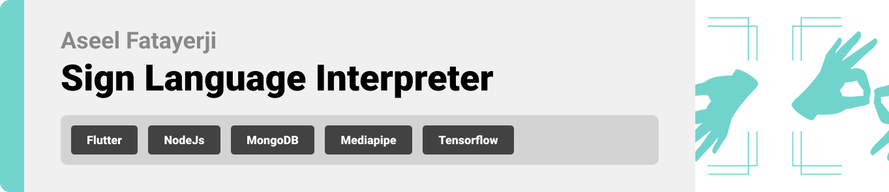

  

<!-- project philosophy -->

>This mobile application enables users to upload files for sign language analysis or to receive real-time interpretation, simplifying the process of learning sign language.
>
> Silent Learning is designed to assist individuals eager to learn and instruct in sign language. Its live interpretation feature enables learners to monitor their advancement and receive constructive feedback for enhancement. Additionally, the app offers two distinct modes: a Learning Mode for students and a Teaching Mode for educators. The latter permits instructors to expand the app's database by incorporating new signs, ensuring the content remains current and comprehensive.

### User Stories
- As a student, I want to practice sign language and receive guidance to improve.
- As a teacher, I want to make sure that my students can practice sign language in my absence and have the most up-to-date information possible.

  
<!-- Tech stack -->

###  Silent Learning is built using the following technologies:

- This project uses the Mediapip and OpenCV packages in Python to create a wireframe that tracks the user's hand and body movements to correctly interpret the signs being done.
- For persistent storage (database), the app uses the MySQL package which allows the app to connect to a database containing all the signs as well as add to it.

  
<!-- UI UX -->

> We designed Silent Learning using wireframes and mockups, iterating on the design until we reached the ideal layout for easy navigation and a seamless user experience.

- Project Figma design [Figma](https://www.figma.com/file/xcOANpKdHBofpmiJXo8pvz/Silent-Learning?type=design&node-id=0-1&mode=design&t=8ozsZ9HivkYXuGxC-0)

### Mockups
| Home screen  | Teacher Screen | Student Screen |
| ---| ---| ---|
|  |  |  |

  

<!-- Database Design -->

###  Architecting Data Excellence: Innovative Database Design Strategies:

- Insert ER Diagram here

  

<!-- Implementation -->

### User Screens (Mobile)
| Login screen  | Register screen | Landing screen |
| ---| ---| ---| ---|
|  |  |  |
| Home screen  | Learning screen | Teaching screen |
| ---| ---| ---| ---|
|  |  |  |

  

<!-- Prompt Engineering -->

###  Mastering AI Interaction: Unveiling the Power of Prompt Engineering:

- This project uses advanced prompt engineering techniques to optimize the interaction with natural language processing models. By skillfully crafting input instructions, we tailor the behavior of the models to achieve precise and efficient language understanding and generation for various tasks and preferences.

  

<!-- AWS Deployment -->

###  Efficient AI Deployment: Unleashing the Potential with AWS Integration:

- This project leverages AWS deployment strategies to seamlessly integrate and deploy natural language processing models. With a focus on scalability, reliability, and performance, we ensure that AI applications powered by these models deliver robust and responsive solutions for diverse use cases.

  

<!-- Unit Testing -->

###  Precision in Development: Harnessing the Power of Unit Testing:

- This project employs rigorous unit testing methodologies to ensure the reliability and accuracy of code components. By systematically evaluating individual units of the software, we guarantee a robust foundation, identifying and addressing potential issues early in the development process.

  

<!-- How to run -->

> To set up Silent Learning locally, follow these steps:

### Prerequisites

This is an example of how to list things you need to use the software and how to install them.
* 

### Installation

_Below is an example of how you can instruct your audience on installing and setting up your app. This template doesn't rely on any external dependencies or services._

Now, you should be able to run Silent Learning locally and explore its features.
