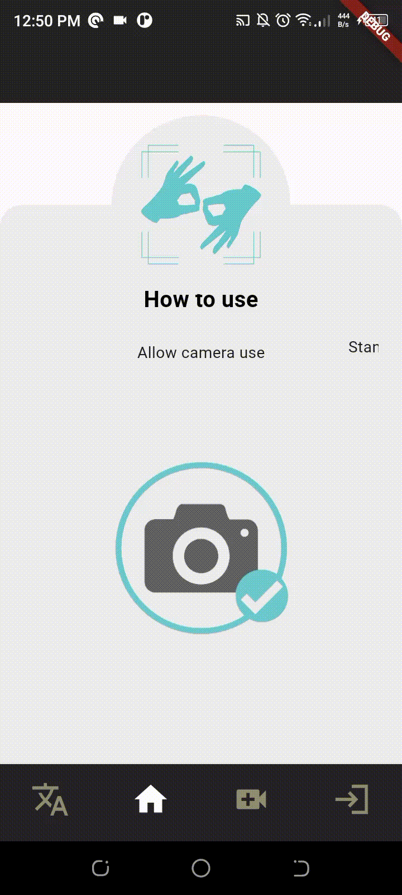

  

<!-- project philosophy -->

img src="./readme/title2.svg"/>

>This mobile application enables users to receive real-time interpretation, simplifying the process of learning sign language and bridging the gap between verbal and non-verbal communitaion.
> 
>Silent Learning is an app that helps people learn sign language. It gives feedback to help learners improve. There are two parts: one for students to learn and one for teachers to add new signs, which keeps the app's sign language collection fresh and full.

### User Stories
- As a user, I want to easily understand sign language so that I can accommodate those with hearing and speaking disabilities.
- As a registered teacher, I want to ensure that the app has the most up-to-date word bank so that anyone using the app can express themselves properly.
- As a system admin, I want to manage teacher accounts so that I can ensure the smooth operation of the translation service and maintain data security.

  
<!-- Tech stack -->

###  Silent Learning is built using the following technologies:

- This project uses the [Mediapipe](https://mediapipe.readthedocs.io/) and [Tensorflow](https://www.tensorflow.org/api_docs) integarted in a Python API to create a wireframe that tracks the user's hand and displays the prediction in the [Flutter](https://docs.flutter.dev/) UI.
- For persistent storage (database), the app uses the MongoDB package which allows the app to connect to a database containing all the users.
- The Tensorflow package comes equiped with Keras which allows us to load in the models and update them without the need for a deticated database.

  
<!-- UI UX -->

> We designed Silent Learning using wireframes and mockups, iterating on the design until we reached the ideal layout for easy navigation and a seamless user experience.

- Project Figma design [Figma](https://www.figma.com/file/xcOANpKdHBofpmiJXo8pvz/Silent-Learning?type=design&node-id=0-1&mode=design&t=8ozsZ9HivkYXuGxC-0)

### Mockups
| Home screen  | Opening Screen | Translate Screen |
| ---| ---| ---|
|  |  |  |

  

<!-- Database Design -->

###  Architecting Data Excellence: Innovative Database Design Strategies:

  

<!-- Implementation -->

### User Screens (Mobile)
| Home screen  | Translating Screen |Language Selection Secreen | Openning Screen | 
| ---| ---| ---| ---|
|  |  |  |  |

### Admin/Teacher Screens (Mobile)
| Profile | Admin Screen | User List Screen | Teaching Screen | 
| ---| ---| ---| ---|
|  |  | |  | 

  

<!-- Prompt Engineering -->

###  Mastering AI Interaction: Unveiling the Power of Prompt Engineering:

- This project employs sophisticated prompt engineering methods to enhance the interaction with natural language processing models. We used these prompts in data collection in order to collect a diverse dataset of ASL gesture examples along with their corresponding word translations. This dataset should cover a wide range of ASL signs, including letters, numbers, common phrases, and more complex signs.

  

<!-- AWS Deployment -->

###  Efficient AI Deployment: Unleashing the Potential with AWS Integration:

- The backend and machine learning APIs are hosted on Amazon Web Services (AWS) for reliable and fast responses. Leveraging AWS's infrastructure ensures high reliability, low latency, and scalability, providing a seamless experience for users worldwide

  

<!-- Unit Testing -->

###  Precision in Development: Harnessing the Power of Unit Testing:

- This project employs rigorous unit testing methodologies to ensure the reliability and accuracy of code components such as: 
 1. Gesture Recognition Accuracy: Test the accuracy of gesture recognition by providing various ASL signs and verifying that the app correctly identifies and translates them into words. This ensures that the app accurately interprets ASL gestures.

 2. Handling of Different Gestures: Test the app's ability to recognize a wide range of ASL gestures, including letters, numbers, common phrases, and more complex signs. Ensure that the app can accurately translate each gesture into the corresponding word or phrase.

 3. Handling of Ambiguous Gestures: Test the app's behavior when presented with ambiguous gestures that could represent multiple words or phrases. Verify that the app selects the most appropriate translation based on context or user input.

 4. Performance Testing: Assess the app's performance by measuring the time it takes to recognize and translate different ASL gestures. Ensure that the translation process is fast and responsive, even for complex or rapid gestures.

  

<!-- How to run -->

> To set up Silent Learning locally, follow these steps:

### Prerequisites

Prerequisites
    1. Flutter SDK: Ensure you have Flutter installed on your machine. If not, follow the installation instructions here.
    2. Development Environment: Set up your preferred code editor or IDE with Flutter and Dart plugins installed.

### Installation
Getting Started
    1. Clone the Repository: Clone the repository containing the Flutter project from the provided GitHub link or using the command below:
    git clone <repository_url>
    2.Navigate to Project Directory: Move into the project directory:
    3.Running the App
        Frontend Install Dependencies: Install the required dependencies for the project by running:
            flutter pub get
        Backend Install Node module: Install the required dependencies for the project by running:
            npm i
Run the backend: Navigate to Project Directory and run
            npm start
Run the App: Launch the app on a connected device or emulator by executing:
        flutter run
    If you have multiple devices connected, specify the device using:   
        flutter run -d <device_id>
    Replace <device_id> with the ID of your desired device.
Testing
    Unit Tests: Execute any available unit tests using:
        flutter test
Build for Production
    Android: To build the app for Android, run:
        flutter build apk

    This generates an APK file located in the build/app/outputs/flutter-apk directory.

    iOS: For building the app for iOS, use:
        flutter build ios
    This generates an iOS application bundle in the build/ios directory.

Additional Notes
Configuration: Modify any necessary configurations such as API endpoints or environment variables in the lib/config.dart file.
Troubleshooting: If you encounter any issues during setup or execution, refer to the official Flutter documentation or community forums for assistance.

Now, you should be able to run Silent Learning locally and explore its features.
