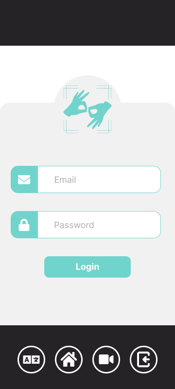

  

<!-- project philosophy -->

>This mobile application enables users to upload files for sign language analysis or to receive real-time interpretation, simplifying the process of learning sign language.
>
> Silent Learning is an app that helps people learn sign language. It gives feedback to help learners improve. There are two parts: one for students to learn and one for teachers to add new signs, which keeps the app's sign language collection fresh and full.

### User Stories
- As a user, I want to easily understand sign language so that I can accommodate those with hearing and speaking disabilities.
- As a registered teacher, I want to ensure that the app has the most up-to-date word bank so that anyone using the app can express themselves properly.
- As a system admin, I want to manage teacher accounts so that I can ensure the smooth operation of the translation service and maintain data security.

  
<!-- Tech stack -->

###  Silent Learning is built using the following technologies:

- This project uses the Mediapipe and Tensorflow integarted with Flutter to create a wireframe that tracks the user's hand and body movements to correctly interpret the signs being done.
- For persistent storage (database), the app uses the MongoDB package which allows the app to connect to a database containing all the users.
- The Tensorflow package comes equiped with Keras which allows us to load in the models and update them without the need for a deticated databse.

  
<!-- UI UX -->

> We designed Silent Learning using wireframes and mockups, iterating on the design until we reached the ideal layout for easy navigation and a seamless user experience.

- Project Figma design [Figma](https://www.figma.com/file/xcOANpKdHBofpmiJXo8pvz/Silent-Learning?type=design&node-id=0-1&mode=design&t=8ozsZ9HivkYXuGxC-0)

### Mockups
| Home screen  | Teacher Screen | Translating Screen | Language Screen |
| ---| ---| ---| ---|
|  |  |  | |

  

<!-- Database Design -->

###  Architecting Data Excellence: Innovative Database Design Strategies:

  

<!-- Implementation -->

### User Screens (Mobile)
| Home screen  | Teacher Screen | Translating Screen |
| ---| ---| ---|
|  |  |  |
| Login screen  | Register Screen | Loading Screen |
| ---| ---| ---|
|  |  |  |

  

<!-- Prompt Engineering -->

###  Mastering AI Interaction: Unveiling the Power of Prompt Engineering:

- This project uses advanced prompt engineering techniques to optimize the interaction with natural language processing models. By skillfully crafting input instructions, we tailor the behavior of the models to achieve precise and efficient language understanding and generation for various tasks and preferences.

  

<!-- AWS Deployment -->

###  Efficient AI Deployment: Unleashing the Potential with AWS Integration:

- This project leverages AWS deployment strategies to seamlessly integrate and deploy natural language processing models. With a focus on scalability, reliability, and performance, we ensure that AI applications powered by these models deliver robust and responsive solutions for diverse use cases.

  

<!-- Unit Testing -->

###  Precision in Development: Harnessing the Power of Unit Testing:

- This project employs rigorous unit testing methodologies to ensure the reliability and accuracy of code components. By systematically evaluating individual units of the software, we guarantee a robust foundation, identifying and addressing potential issues early in the development process.

  

<!-- How to run -->

> To set up Silent Learning locally, follow these steps:

### Prerequisites

This is an example of how to list things you need to use the software and how to install them.
* 

### Installation

_Below is an example of how you can instruct your audience on installing and setting up your app. This template doesn't rely on any external dependencies or services._

Now, you should be able to run Silent Learning locally and explore its features.
